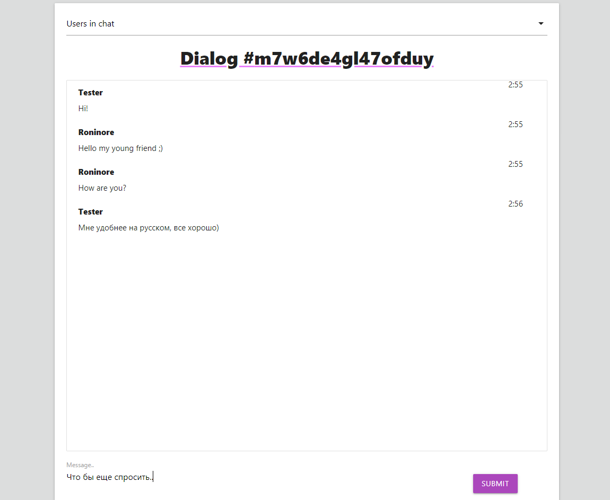
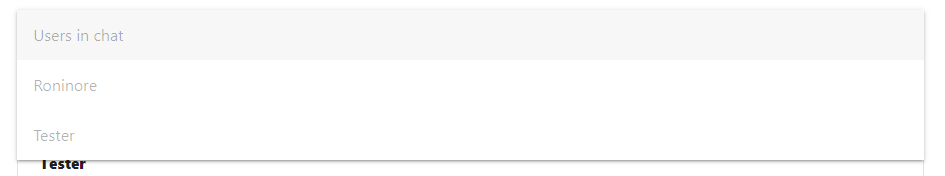

## Simple chat application
 - socket.io (instant send messages to all users on chat)
 - React (client)
 - Express (server)
 - mongoDB |mongoose (database)

You can create chat and send to your friend a link. 
Chat can support unlimited* number of users.

## Простое приложение-чат
 - socket.io (мгновенная доставка сообщений всем пользователям в чате)
 - React (клиент)
 - Express (сервер)
 - mongoDB |mongoose (база данных сообщений и чатов)

Вы можете создать чат и отправить ссылку на него вашему другу.
Чат может поддерживать неограниченное* количество пользователей.

#### Chat example | Пример интерфейса чата

#### List of connected users | Список подключенных пользователей

###### by Roninore 2021
